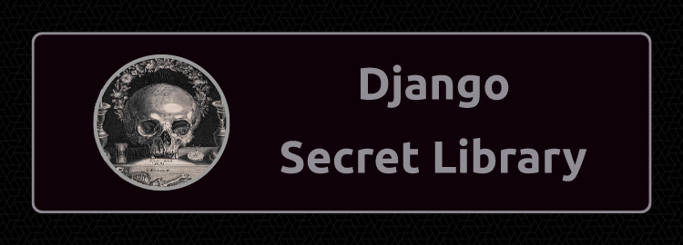

# The Secret Library



Library System made with Django.

## Installation

### Clone the Repository

```
git clone https://github.com/the-akira/The-Secret-Library.git
```

### Inside the Main Directory

Create a Virtual Environment

```
python -m venv myvenv
```

Activate the Virtual Environment

```
source myvenv/bin/activate
```

Install Requirements

```
pip install -r requirements.txt
```

Run the Application

```
python manage.py runserver
```

You can now open your Web Browser and navigate to `http://127.0.0.1:8000/` to see the Web Application.
